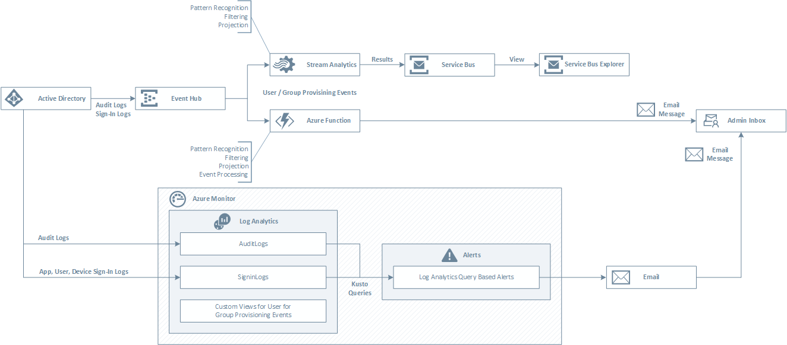

## Introduction
This sample shows how to process Azure Active Directory provisioning events stored in Activity Logs from an Event Hub using an Azure Function or Stream Analytics job.

## Architecture
The following picture shows the architecture design of the application.

